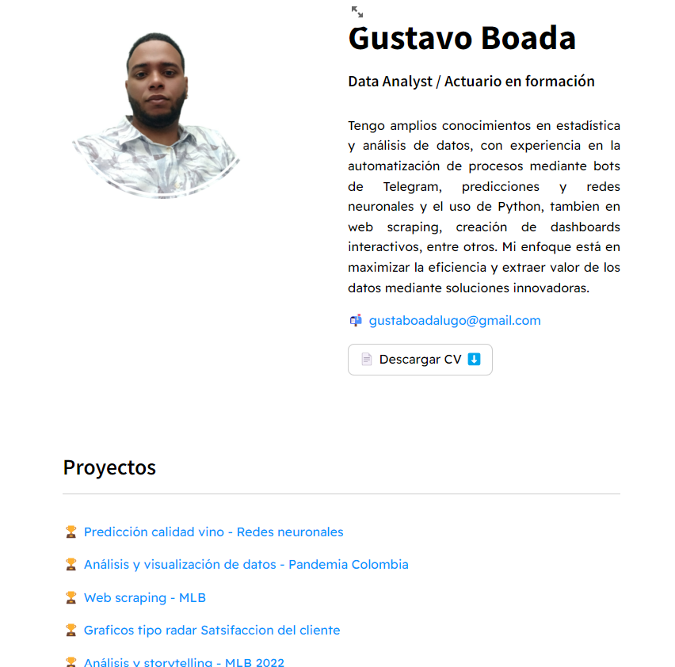

#  Portafolio de Proyectos de Datos

**Resumen:**

Este repositorio es una colección de proyectos que demuestran mis habilidades en ciencia de datos, visualización y automatización de tareas. 
Aquí encontrarás desde análisis exploratorios de datos hasta modelos predictivos y dashboards interactivos.

**Introducción:**

Soy Gustavo Boada, un apasionado de los datos con experiencia en Python, SQL, Machine Learning. En este portafolio, podrás explorar una variedad de proyectos que abarcan diferentes áreas de la ciencia de datos.

**Proyectos destacados:**

* **Web scraping - MLB**
* **Graficos tipo radar Satsifaccion del cliente** 
* **Análisis y storytelling - MLB 2022**

**Tecnologías utilizadas:**

* **Lenguajes:** Python, SQL, CSS
* **Bibliotecas:** Pandas, NumPy, Scikit-learn, TensorFlow, Keras, Plotly, Seaborn, etc.
* **Herramientas:** Jupyter Notebook, Git, Streamlit cloud, Namecheap, Cpanel.

**Cómo contribuir:**

Si estás interesado en contribuir a este proyecto, por favor, sigue estos pasos:
1. Forkea este repositorio.
2. Crea una nueva rama para tus cambios.
3. Realiza tus cambios y haz un commit.
4. Envía un pull request.

**Contacto:**

* **Email:** [gusavoboadalugo@gmail.com]
* **LinkedIn:** [[Gustavo Boada lugo](https://www.linkedin.com/in/gboada23/)]

---

## **Link del Portafolio**
  **Portafolio:** [[Accede al portafolio](https://portafolio-gustavo-boada.streamlit.app/)]  

